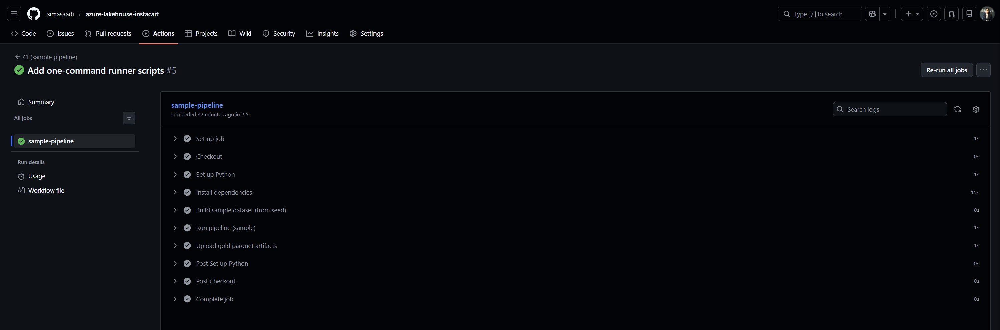
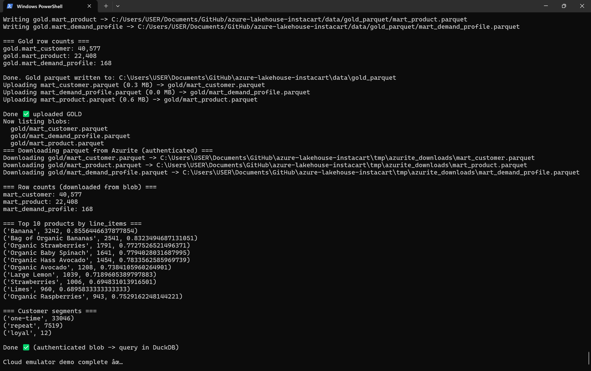

# Azure-style Lakehouse (Instacart) — Local + CI + Cloud Emulator

End-to-end analytics pipeline using Instacart Market Basket Analysis data with a lakehouse-style layout:

- **Bronze/Raw**: CSVs (local only, not committed)
- **Silver**: cleaned dimensions + facts as Parquet
- **Gold**: analytics marts as Parquet
- **CI**: runs on a small deterministic sample
- **Azure-style cloud path (no subscription required)**: uploads Gold Parquet to **Azurite** (Azure Blob emulator), downloads with Azure SDK, queries with DuckDB

## What this demonstrates
- Lakehouse concepts: **raw → silver → gold**
- Reproducible local runs (one-command scripts)
- CI that validates pipeline + quality checks on a small dataset
- Azure Blob–compatible workflow using **Azurite** (storage emulator)

---

## Architecture
See: [`docs/architecture.md`](docs/architecture.md)

**CI proof**  


**Cloud emulator proof**  


---

## Repo layout
- `data/raw/` — full Kaggle CSVs (local only, ignored by git)
- `data/seed/` — tiny commit-friendly seed dataset
- `data/sample/` — generated sample dataset for CI
- `data/silver_parquet/` — silver outputs
- `data/gold_parquet/` — gold marts
- `warehouse/` — DuckDB databases (local only)
- `scripts/` — pipeline scripts
- `infra/azure/terraform/` — Azure IaC placeholder (optional)
- `run_ci_sample.ps1` — run what CI runs, locally
- `run_local_raw.ps1` — run full pipeline locally
- `run_cloud_emulator.ps1` — Azurite upload/download/query demo

---

## Quick start (Windows / PowerShell)

### 1) Create venv + install dependencies
```powershell
python -m venv .venv
.\.venv\Scripts\Activate.ps1
python -m pip install --upgrade pip
pip install -r requirements.txt
